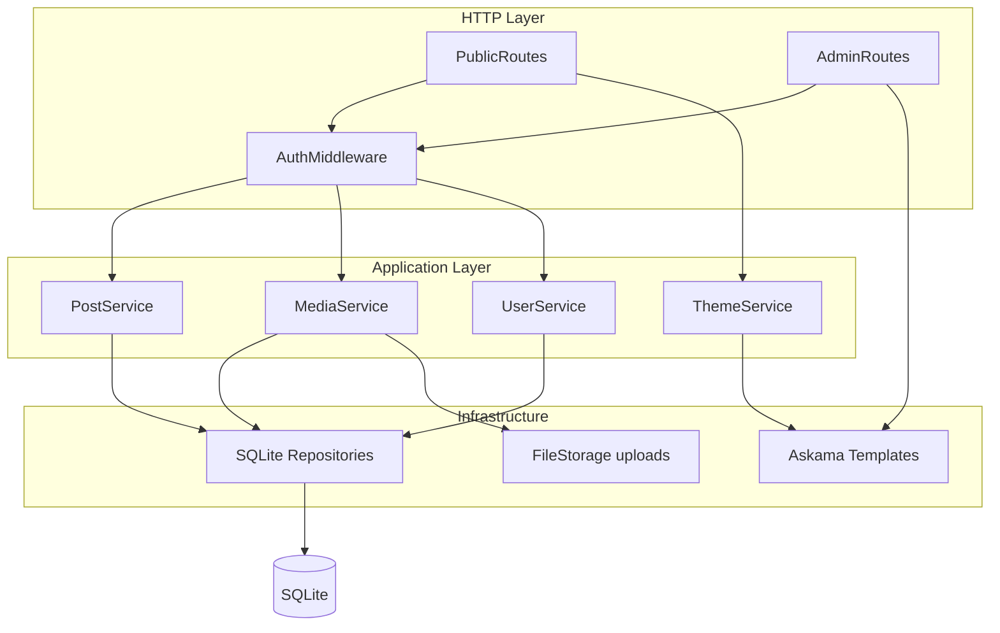
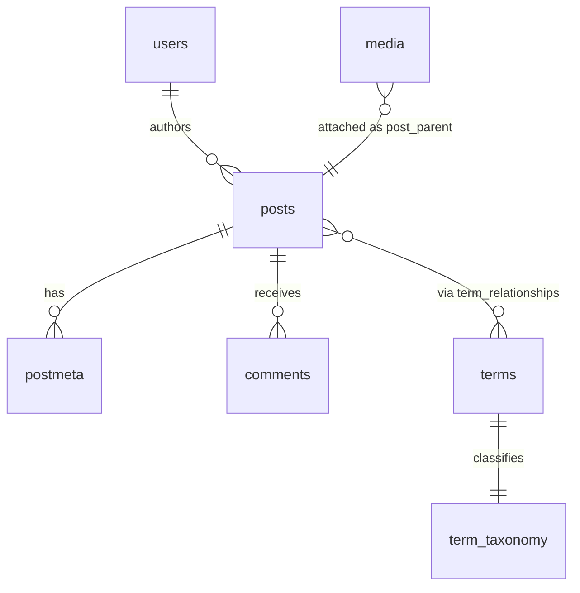
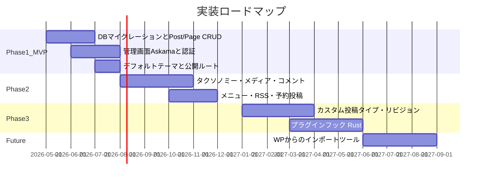

# rust-sqlite-cms

Rust と SQLite で動作する軽量 CMS です。WordPress と**機能面で同等**な体験（投稿・固定ページ・メディア・ユーザー権限・コメント・設定・テーマなど）を段階的に実装することを目指します。

- 単一バイナリで配布・運用しやすい構成
- 組み込み SQLite によるシンプルなデータ永続化
- [Askama](https://github.com/askama-rs/askama) によるサーバーサイドレンダリング（公開サイト・管理画面とも）

> **現状**: 初期実装に着手しました。`cargo run` で axum サーバーが起動し、`http://127.0.0.1:8080/admin` にアクセスすると Askama SSR による管理画面（ダッシュボードのスケルトン）が表示されます。認証・SQLite・各リソースの CRUD は未実装で、ロードマップに沿って順次追加します。

## 設計思想

| 方針 | 内容 |
|------|------|
| WordPress との関係 | **機能の同等性**を重視（コンテンツモデル・管理ワークフロー・権限など） |
| REST API (`/wp-json/...`) | **非対応**（独自の HTML フォーム + SSR が中心） |
| WordPress からの移行 | **将来・低優先**（WXR / DB インポートは Phase Future） |
| 管理画面 | **Askama SSR**（JavaScript フレームワークに依存しない） |
| データベース | SQLite（WP の MySQL スキーマに**似せた命名**、MySQL 互換や `wp_` プレフィックス厳守はしない） |

## アーキテクチャ

リクエストは HTTP 層 → アプリケーション層（サービス）→ インフラ層（リポジトリ・ファイル・テンプレート）の順で処理します。



### レイヤーの責務

- **routes**: ルーティング、リクエストのパース、レスポンス形式の選択
- **services**: ビジネスルール、権限（capabilities）チェック、トランザクション境界
- **repos**: SQL とモデル間のマッピング（1 テーブル ≈ 1 リポジトリを目安）
- **auth**: セッション、ロール、 capability の解決
- **themes / templates**: Askama テンプレートのレンダリング

## 技術スタック（予定）

| 用途 | クレート | 備考 |
|------|----------|------|
| HTTP | `axum` + `tokio` | 軽量・型安全 |
| DB | `rusqlite` または `sqlx` | マイグレーションは `refinery` または手書き SQL |
| テンプレート | `askama` + `askama_axum` | コンパイル時テンプレート検証 |
| 設定 | `figment` / `serde` | TOML + 環境変数 |
| 認証 | `tower-sessions` + `argon2` | セッション Cookie |
| ログ | `tracing` + `tracing-subscriber` | 構造化ログ |
| 日時 | `chrono` | 予約投稿など |
| スラッグ | `slug` | パーマリンク用 |

- **Rust edition**: `2024`（Rust **1.85 以降**を想定）
- **データベース**: SQLite 3

## ディレクトリ構成（目標形）

```
rust-sqlite-cms/
├── README.md
├── Cargo.toml
├── config.example.toml      # 設定のサンプル（実装時にコピーして config.toml へ）
├── migrations/              # SQLite スキーマ（バージョン管理）
├── themes/                  # 公開サイト用 Askama テーマ（WP の themes/ に相当）
│   └── default/
│       ├── templates/       # *.html
│       └── assets/          # CSS / JS（静的配信）
├── uploads/                 # メディア実体（.gitignore 対象）
└── src/
    ├── main.rs              # 起動・DI・ルーター組み立て
    ├── lib.rs
    ├── config.rs
    ├── error.rs             # AppError → HTTP レスポンス
    ├── db/                  # 接続・マイグレーション
    ├── models/
    ├── repos/
    ├── services/
    ├── auth/
    ├── routes/
    │   ├── public.rs
    │   └── admin/
    └── templates/           # 管理画面用 Askama（テーマと分離）
        └── admin/
```

**テーマと管理 UI の分離**: 公開テーマは `themes/{name}/`、管理画面は `src/templates/admin/` に置きます。WordPress の「テーマは切り替え可能・管理画面は共通」と同じ関係です。

## WordPress 機能との対応

| WordPress 概念 | 本 CMS での表現 | フェーズ |
|----------------|-----------------|----------|
| 投稿 (post) | `posts` テーブル、`post_type = 'post'` | Phase 1 |
| 固定ページ (page) | 同上、`post_type = 'page'`、`parent_id` で階層 | Phase 1 |
| ステータス | `draft` / `publish` / `future` / `trash` | Phase 1 |
| ユーザー・ロール | `users` + ロール + capabilities | Phase 1 |
| 設定 (options) | `options` key-value | Phase 1 |
| テーマ | `themes/` + `active_theme` オプション | Phase 1 |
| カテゴリ・タグ | `terms` + `term_taxonomy` + `term_relationships` | Phase 2 |
| メディアライブラリ | DB メタデータ + `uploads/` ファイル | Phase 2 |
| コメント | `comments`（承認・スパム状態） | Phase 2 |
| メニュー | `nav_menus` + `nav_menu_items` | Phase 2 |
| RSS | `/feed/` | Phase 2 |
| 予約投稿 | `status = future` + 公開日時 | Phase 2 |
| カスタム投稿タイプ (CPT) | `post_type` + 登録設定 | Phase 3 |
| リビジョン | `post_revisions` | Phase 3 |
| カスタムフィールド | `postmeta` key-value | Phase 1（基本）/ Phase 3（拡張） |
| プラグイン | Rust trait / 設定駆動フック | Phase 3 |
| WP からのインポート | WXR / DB ツール | Future（低優先） |

## データモデル概要

主要エンティティの関係（簡略）:



### 主要テーブル（予定）

| テーブル | 用途 |
|----------|------|
| `posts` | 投稿・固定ページ・添付のメタ行（`post_type`, `post_status`, `post_author`, `post_parent`, `post_name` など） |
| `postmeta` | カスタムフィールド（key-value） |
| `users` | ユーザーアカウント |
| `usermeta` | ユーザーメタ |
| `options` | サイト設定（`siteurl`, `blogname`, `permalink_structure`, `active_theme` など） |
| `terms` | ターム名・スラッグ |
| `term_taxonomy` | タクソノミー種別（`category`, `post_tag`, …） |
| `term_relationships` | 投稿とタームの関連 |
| `comments` | コメント本文・承認状態 |
| `post_revisions` | 本文リビジョン（Phase 3） |

### SQLite スキーマ方針

- 型は `INTEGER PRIMARY KEY`, `TEXT`, 必要に応じて `JSON`
- 外部キーで参照整合性を担保
- 全文検索は Phase 1 では `LIKE`、将来 **FTS5** を検討

## 権限モデル

WordPress に倣ったロールと capability です。各 `Service` メソッドの先頭で検証します。

| ロール | 概要 |
|--------|------|
| **Administrator** | すべての管理操作 |
| **Editor** | 他人の投稿の編集・公開 |
| **Author** | 自分の投稿の作成・公開 |
| **Contributor** | 投稿の作成（公開は不可） |
| **Subscriber** | コメント・プロフィールのみ |

Capability の例: `edit_posts`, `publish_posts`, `edit_others_posts`, `manage_options`, `moderate_comments`

## ルーティング（予定）

WordPress の URL や REST API とは**互換ではありません**。機能に相当する HTML ルートを提供します。

### 公開サイト

| メソッド | パス | 内容 |
|----------|------|------|
| GET | `/` | 最新投稿一覧 |
| GET | `/{year}/{month}/{day}/{slug}/` | 投稿（パーマリンク設定で変化） |
| GET | `/page/{slug}/` | 固定ページ |
| GET | `/category/{slug}/` | カテゴリ一覧 |
| GET | `/tag/{slug}/` | タグ一覧 |
| GET | `/feed/` | RSS（Phase 2） |

### 管理画面（要ログイン・Askama）

| メソッド | パス | 内容 |
|----------|------|------|
| GET | `/admin` | ダッシュボード（実装済み・暫定で認証なし） |
| GET, POST | `/admin/login` | ログイン（WP の `wp-login.php` 相当。エイリアスは将来検討） |
| GET, POST | `/admin/posts`, `/admin/posts/new`, `/admin/posts/{id}/edit` | 投稿 CRUD |
| 同様 | `/admin/pages`, `/admin/media`, `/admin/users`, `/admin/settings`, `/admin/comments` | 各リソース管理 |

## テーマ開発

公開サイトは `themes/{theme_name}/templates/` 以下の Askama テンプレートで描画します。

```
themes/default/templates/
├── index.html      # 投稿一覧
├── single.html     # 単一投稿
├── page.html       # 固定ページ
├── archive.html    # アーカイブ
└── partials/
    ├── header.html
    └── footer.html
```

テンプレートには Rust 側で組み立てたコンテキスト（例: `PostList`, `Post`, `Site`, `Menu`）を渡します。PHP テーマや WordPress テンプレートタグは**そのままでは使えません**。

管理画面は `src/templates/admin/` に固定し、テーマ切り替えの影響を受けません。

## 設定ファイル

実装後は `config.example.toml` を `config.toml` にコピーして利用します。

```toml
# config.example.toml

[server]
# リッスンアドレス（例: "127.0.0.1:8080"）
bind_addr = "127.0.0.1:8080"

[database]
# SQLite データベースファイルのパス
path = "data/cms.db"

[paths]
# メディアのアップロード先
uploads_dir = "uploads"
# テーマのルートディレクトリ
themes_dir = "themes"

[site]
# 表示名・説明（options テーブルと同期する想定）
title = "My Site"
tagline = "Just another rust-sqlite-cms site"

[theme]
# 有効テーマ名（themes/ 以下のディレクトリ名）
active = "default"

[session]
# セッション Cookie 名・有効期限（秒）
cookie_name = "cms_session"
max_age_secs = 604800

[security]
# 本番では必ず環境変数 CMS_SESSION_SECRET 等で上書きすること
# session_secret = "change-me-in-production"
```

環境変数での上書き例（予定）:

| 変数 | 説明 |
|------|------|
| `CMS_BIND_ADDR` | リッスンアドレス |
| `CMS_DATABASE_PATH` | DB ファイルパス |
| `CMS_SESSION_SECRET` | セッション署名用シークレット |

## ロードマップ



### Phase 1（MVP）

- SQLite マイグレーション
- 投稿・固定ページの CRUD（公開・下書き）
- ユーザー・ログイン・基本ロール
- サイト基本設定（`options`）
- デフォルトテーマと公開ルート
- 管理画面（Askama）

### Phase 2

- カテゴリ・タグ
- メディアライブラリ（アップロード・添付）
- コメント（モデレーション）
- ナビゲーションメニュー
- RSS フィード
- 予約投稿

### Phase 3

- カスタム投稿タイプ
- リビジョン
- ウィジェット相当のサイドバー領域
- Rust ベースの拡張フック（プラグイン相当）

### Future（低優先）

- WordPress WXR または DB からのインポート
- FTS5 による全文検索
- パーマリンクの WP 風エイリアス（任意）

## 開発の始め方

### 前提

- Rust 1.85 以降（edition 2024）
- Cargo

### ビルド・実行（現状）

```bash
git clone <repository-url>
cd rust-sqlite-cms
cargo build
cargo run
```

現時点では上記コマンドで axum サーバーが `127.0.0.1:8080` で起動し、`http://127.0.0.1:8080/admin` で管理画面のスケルトンが表示されます（`/` は暫定的に `/admin` へリダイレクト）。認証は未実装のためログインなしで開けます。実装が進むと、初回起動時にマイグレーションが走り `data/cms.db` が作成される想定です。

### 今後の開発フロー（予定）

1. `config.example.toml` を `config.toml` にコピーして編集
2. `cargo run` でサーバー起動
3. ブラウザで `http://127.0.0.1:8080/admin/login` にアクセス

## セキュリティ上の考慮（設計）

- **XSS**: Askama の自動 HTML エスケープを利用。生 HTML を出す場合は明示的なサニタイズ方針を文書化
- **CSRF**: 管理画面の POST フォームには CSRF トークンを付与
- **認証**: パスワードは argon2 でハッシュ。セッション Cookie は HttpOnly / Secure（本番）を推奨
- **アップロード**: MIME 検証、サイズ上限、実行可能拡張子の拒否

## 非目標（Non-Goals）

以下は**スコープ外**または**初期バージョンでは対応しない**ものです。

- PHP テーマ・PHP プラグインの実行
- WordPress REST API（`/wp-json/wp/v2/...`）との互換
- WordPress マルチサイト
- MySQL / `wp_` テーブルプレフィックスとの厳密な DB 互換
- `wp-login.php` 等の URL の完全再現（必要なら将来エイリアスのみ検討）

## ライセンス

TBD（リポジトリオーナーが決定するまで未設定）
