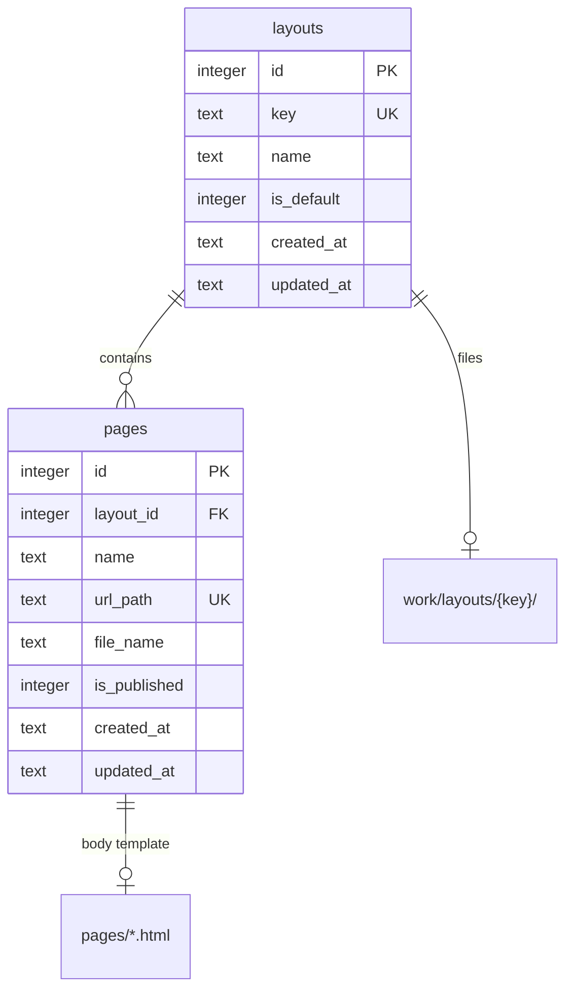
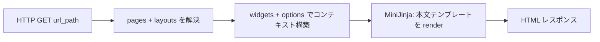

# レイアウト（Layout）詳細設計

本ドキュメントは、公開サイトのページ管理を **レイアウト単位** に再編するための詳細設計です。
利用方法・現行実装の全体像は [README.md](../README.md) と [PLAN.md](./PLAN.md) を参照してください。

| 項目 | 内容 |
|------|------|
| ステータス | **Phase A/B 実装済み**（エクスポート等の Phase C は未着手） |
| 対象フェーズ | Phase 2 候補（ページ管理の構造変更） |
| 関連コード（現行） | `src/theme/`, `src/models/page.rs`, `src/page_render.rs`, `migrations/0001_init.sql` |

---

## 背景と課題

### 現行モデル（Phase 1）

- 公開ページは `pages` テーブルにメタ情報、本文は `work/` 配下のファイルに保持する。
- ページごとに `is_static` があり、保存先と公開時の扱いが分岐する。

| `pages.is_static` | 本文の保存先 | 公開時 |
|-------------------|--------------|--------|
| `0` | `work/templates/` | MiniJinja で評価 |
| `1` | `work/pages/` | 生 HTML をそのまま返す |

- 静的アセットはサイト全体で `work/templates/static/` を `/static` で配信。
- 同梱プリセット（`presets/`）はページ作成時に **HTML 一式**（`<style>` や nav を含む）を複製するため、複数ページ間で共通 CSS/JS を共有しづらい。
- 管理画面の「静的 HTML」トグルは、見た目の統一（共通レイアウト）とは別軸の設定になり、運用が分かりにくい。

### 解決したいこと

1. 複数ページにまたがる **共通の枠（shell）と CSS/JS** を、ひとまとまりの単位で管理したい。
2. 「ページは必ずどれかのレイアウトに属する」という **単純なルール** にしたい。
3. 作業ディレクトリを **`work/layouts/` に集約** し、`work/templates/` と `work/pages/` の二重構造をやめたい。
4. 公開時の描画方式を **MiniJinja に一本化** し、`is_static` フラグを廃止する（後述の将来拡張は除く）。

---

## 設計方針（確定ルール）

以下を本仕様の前提とする。

| # | ルール |
|---|--------|
| R1 | **すべての `Page` は必ず 1 つの `Layout` に属する**（`pages.layout_id NOT NULL`）。孤児ページは存在しない。 |
| R2 | **公開ページの本文・shell はすべて MiniJinja テンプレート** とする。生 HTML の直返しや `is_static` による分岐は行わない。 |
| R3 | 公開用ファイルは **`work/layouts/{layout_key}/` 配下に集約**する（shell・pages・static）。 |
| R4 | 公開時は **ページ本文テンプレートを MiniJinja で評価** する。標準パターンは本文が `shell.html` を `extends` すること。 |
| R5 | サイトには **常に 1 件以上のレイアウト** と、**ちょうど 1 件の既定レイアウト**（`layouts.is_default = 1`）を持つ。 |

### `is_static` 廃止について

- Phase 1 の `pages.is_static` および「レイアウト単位の `is_static`」案は **採用しない**。
- ページ本文に MiniJinja 構文が無い場合でも、ファイルはテンプレートとして保存・評価する（実質的には HTML だが、エンジンは常に MiniJinja）。
- **超高速化**（テンプレート評価の省略、事前生成 HTML の配信など）が必要になった場合は、本仕様の外で [将来拡張](#将来拡張パフォーマンス) として別途設計する。

### 意図的なトレードオフ

- **レイアウト変更はコンテンツ移行を伴う可能性がある。**
  - 別レイアウトへ移すときは、本文の `extends` パスや shell の block 名の差異に注意。管理画面で警告または移行手順を示す。
- **すべての公開 HTML が MiniJinja を通る**ため、極端な低遅延要件には現時点では向かない（将来の高速パスで対応）。

### 用語

| 用語 | 意味 |
|------|------|
| **Layout（レイアウト）** | 複数ページで共有する shell・静的アセットのまとまり。DB 行 + `work/layouts/{key}/` ディレクトリ。 |
| **shell** | 共通の HTML 枠（`<head>`、nav、footer、共通 CSS 参照など）。`shell.html`（MiniJinja）。 |
| **Page（ページ）** | URL・公開フラグ・表示名などのメタ情報と、`pages/` 配下の本文テンプレート。必ず 1 レイアウトに所属。 |
| **本文** | ページ固有の MiniJinja テンプレート。`work/layouts/{key}/pages/{file}`。 |

**命名注意**: コードベースには公開サイト I/O 用の `crate::theme` モジュールが既にある。DB テーブル・管理画面ラベルでは **Layout / レイアウト** を使い、単独の `theme` というテーブル名は避ける（モジュール名との混同防止）。

---

## 概念モデル



- **Layout**: 1 フォルダ（`work/layouts/{key}/`）と 1 DB 行。
- **Page**: レイアウト内の 1 テンプレートファイル + 1 DB 行。URL はサイト全体で一意（現行と同様）。

---

## データベース

### 新規テーブル `layouts`

```sql
CREATE TABLE IF NOT EXISTS layouts (
    id           INTEGER PRIMARY KEY,
    key          TEXT    NOT NULL UNIQUE,  -- 英数字とハイフン。パス・URL に使用
    name         TEXT    NOT NULL DEFAULT '',
    is_default   INTEGER NOT NULL DEFAULT 0, -- 1 がちょうど1件（アプリで担保）
    favicon_media_id INTEGER,              -- メディア（attachment）ID。未設定は NULL
    created_at   TEXT    NOT NULL DEFAULT (strftime('%Y-%m-%dT%H:%M:%SZ', 'now')),
    updated_at   TEXT    NOT NULL DEFAULT (strftime('%Y-%m-%dT%H:%M:%SZ', 'now'))
);
CREATE INDEX IF NOT EXISTS idx_layouts_default ON layouts(is_default);
```

**`key` の制約（アプリ側）**

- 例: `default`, `corporate`, `lp-2026`
- 予約: `_shared` は共有 static 用の例外フォルダとして将来検討可（本フェーズでは必須としない）。

### 変更 `pages`

```sql
-- 追加
layout_id    INTEGER NOT NULL REFERENCES layouts(id) ON DELETE RESTRICT,

-- 削除
is_static    -- 廃止（移管先なし）
```

**`file_name`**

- レイアウトディレクトリからの **相対パス**（例: `pages/page-3.html`）。
- サイト全体での一意性は、実装上 `(layout_id, file_name)` の組で担保する（現行の `file_name` 単独 UNIQUE は見直す）。

**トップページ**

- 現行: `file_name = 'index.html'` をホーム判定に使用（`Page::is_home()`）。
- 移行後: **`url_path = '/'`（または正規化後のトップパス）をホーム判定の主**とし、`file_name` は `pages/index.html` などレイアウト内パスに統一する案を推奨。

### シード・不変条件

| 不変条件 | 内容 |
|----------|------|
| レイアウト数 | ≥ 1 |
| 既定レイアウト | `is_default = 1` がちょうど 1 件 |
| ページ所属 | すべての `pages.layout_id` が有効な `layouts.id` を参照 |
| レイアウト削除 | 所属ページがある場合は `RESTRICT`（先にページを移動または削除） |

---

## ファイルシステム

### ディレクトリ構造

```
work/layouts/
├── default/                      # 既定レイアウト（key と同名）
│   ├── shell.html                # 共通枠（MiniJinja）
│   ├── static/                   # レイアウト専用 CSS / JS / 画像
│   │   ├── site.css
│   │   └── site.js
│   └── pages/
│       ├── index.html            # トップ（url_path = /）
│       └── page-{id}.html        # その他ページ（現行の命名を踏襲可）
└── corporate/
    ├── shell.html
    ├── static/
    └── pages/
        └── about.html
```

**廃止するパス（移行後）**

| 現行 | 移行後 |
|------|--------|
| `work/templates/` | `work/layouts/{key}/`（shell + pages） |
| `work/templates/static/` | `work/layouts/{key}/static/` |
| `work/pages/` | 廃止。内容は `work/layouts/{key}/pages/` へ統合し、MiniJinja 化 |

### `shell.html`

- MiniJinja テンプレート。サイト共通変数（`blogname`, `blogdescription`, `favicon_url`）およびウィジェット由来変数（`news_html` など）を参照できる。
- `favicon_url` は管理画面でレイアウトに紐づけたメディアの公開 URL（`/uploads/...`）。shell の `<head>` に `<link rel="icon" href="{{ favicon_url }}">` を書く。既定レイアウトの favicon は `GET /favicon.ico` でも配信される。
- ページ本文の差し込み用ブロックを定義する（例: ``）。
- 共通 CSS は `<link href="/static/{layout_key}/site.css">` のように **外部 static** を参照する（インライン `<style>` の重複は seed 移行時に削減）。

### ページ本文テンプレート（`pages/*.html`）

標準形:

```jinja

{{ blogname }} — ページ名

  <article>...</article>

```

- `extends` のパスはローダールート（`work/layouts`）からのテンプレート名とする（[MiniJinja ローダー](#minijinja-ローダー) 参照）。
- 本文に `{{ }}` / `` が無い「ほぼ HTML」でも、上記のようにテンプレートファイルとして扱う。

---

## 公開時の描画パイプライン



### 疑似コード（`page_render` 相当）

```
fn render_public_page(page, layout, state):
    ctx = build_site_context(state)  // 現行の widgets + options
    template_name = "{layout.key}/{page.file_name}"
    return render_template(template_name, ctx)
    // 本文側が  する想定
```

- **分岐なし**。`read_page_content(..., is_static)` や生 HTML 直返しは実装しない。
- プレビューも同一パイプライン（ウィジェット注釈オプションのみ現行と同様）。

### MiniJinja ローダー

**採用案**: ローダールートを `work/layouts` とし、テンプレート名にレイアウト key を含める。

| テンプレート名の例 | 実ファイル |
|--------------------|------------|
| `default/shell.html` | `work/layouts/default/shell.html` |
| `default/pages/index.html` | `work/layouts/default/pages/index.html` |

- `AutoReloader` の監視パスは `work/layouts` 配下を再帰的に watch（現行の `work/templates` と同様の運用感）。
- Phase 2 初版では **エンジン 1 つ + パスプレフィックス** を推奨（実装が単純）。

---

## 静的アセット配信

### URL 規約（推奨）

| パス | ファイル |
|------|----------|
| `GET /static/{layout_key}/*` | `work/layouts/{layout_key}/static/*` |

HTML からの参照例:

```html
<link rel="stylesheet" href="/static/default/site.css">
<script src="/static/default/site.js" defer></script>
```

- レイアウト間でファイル名が衝突しても、`layout_key` で名前空間が分かれる。
- 全レイアウト共通のファイルが必要になった場合のみ、将来 `work/layouts/_shared/static/` と `/static/_shared/*` を追加検討。

### 現行 `/static/*` からの移行

| 現行 | 移行後 |
|------|--------|
| `/static/foo.css` → `work/templates/static/foo.css` | `/static/default/foo.css` → `work/layouts/default/static/foo.css` |

既存の `index.html` 内インライン `<style>` は、段階的に `static/` へ抽出してよい（必須ではない）。

---

## ウィジェット・プレースホルダー

現行: プレースホルダーはページ（テンプレート）ごとに配置し、変数名で `{{ news_html | safe }}` 等を埋め込む。

### Phase 2 初版

- スコープは **現行どおりページ単位** のままとする（`placeholders` スキーマ変更なし）。
- shell にグローバルナビ等を載せる場合は、**既定レイアウトのトップページ** にプレースホルダーを置き、他ページの shell に同じ変数名を手で書く、または shell を編集して共通埋め込みする。

### 将来拡張（本仕様では未確定）

| 案 | 用途 |
|----|------|
| `placeholders.layout_id` | レイアウト内の全ページで共通のウィジェット（フッタお知らせ等） |
| `placeholders.layout_id IS NULL` | サイト全体共通 |

複数レイアウトを運用し始めたタイミングで検討する。

---

## 管理画面・API

### 画面構成（案）

```
/admin/layouts          … レイアウト一覧（作成・編集・削除・既定の設定）
/admin/layouts/{id}     … shell 編集、static へのリンク案内
/admin/pages            … ページ一覧（レイアウト列を表示）
/admin/pages/new        … まずレイアウト選択 → プリセット（本文雛形）選択
/admin/pages/{id}/edit  … 本文テンプレート編集（レイアウト変更は別操作・警告付き）
```

- ページフォームから **「静的 HTML」チェックボックスを削除**（`is_static` 廃止）。
- レイアウト作成・編集に **`is_static` 相当の設定項目は設けない**。

### REST API `/api/v1`（案）

| リソース | 操作 |
|----------|------|
| `layouts` | CRUD（`is_static` フィールドなし） |
| `pages` | CRUD（`layout_id` 必須、`is_static` フィールド廃止） |

移行期間中、API クライアントが `is_static` を送っても **無視** する（deprecated レスポンスフィールドの要否は [未決事項](#未決事項検討メモ)）。

---

## プリセット（`presets/`）の位置づけ

現行の「デザイン」選択（`landing`, `simple-page`, `news`）は次のように再定義する。

| 現行プリセット | 移行後の解釈 |
|----------------|--------------|
| `landing` | **shell + `pages/` 雛形**（ヒーロー等は `` 内） |
| `simple-page` | **本文のみの雛形**（`extends` 付き。shell はレイアウト共通） |
| `news` | **ウィジェット変数を含む本文雛形**（`extends` 付き） |

- ギャラリー UI（`/admin/pages/new`）は「レイアウトを選ぶ / 新規レイアウト＋初回ページを作る」の二段に発展させてよい。
- 同梱 `presets/index.html` の seed は `default/shell.html` と `default/pages/index.html` へ **分割** する（nav/footer/CSS を shell、トップ固有を pages）。

---

## 現行実装からの移行

### データ移行（既存 DB がある場合）

1. `layouts` を作成し、`key = 'default'`, `is_default = 1` を投入。
2. 既存 `pages` の各行に `layout_id = default.id` を設定。
3. `pages.is_static` カラムを削除。
4. 現行 `is_static = 1` だったページは、ファイルを `work/layouts/.../pages/` に移し、**`` + ``** へ変換する（下記ファイル移行）。

### ファイル移行

| 現行パス | 移行先 |
|----------|--------|
| `work/templates/index.html` | `work/layouts/default/pages/index.html` + shell 抽出 |
| `work/templates/page-*.html` | `work/layouts/default/pages/page-*.html` + `extends` 付与 |
| `work/templates/static/*` | `work/layouts/default/static/*` |
| `work/pages/*` | `work/layouts/default/pages/*`（MiniJinja 化。生 HTML は block 内へ） |

- 各完結 HTML から **shell 相当部分を抽出** して `shell.html` に集約する。
- 残りを `...` に入れ、`` を先頭に追加する。

### コード変更の主なタッチポイント

| モジュール | 変更概要 |
|----------|----------|
| `src/theme/mod.rs` | パスを `layouts_dir` に再編。`pages_dir` / `read_page_content(..., is_static)` を廃止。 |
| `src/page_render.rs` | MiniJinja 単一路線。生 HTML 分岐削除。 |
| `src/models/` | `Layout` モデル追加、`Page` から `is_static` 削除。 |
| `src/repos/`, `src/services/` | `layouts` CRUD、ページ作成時の `layout_id` 必須化。 |
| `src/routes/admin/pages.rs` | 静的トグル・`simple-page` の is_static 特例削除。 |
| `src/routes/public.rs` | `/static/{key}/*` ルート追加または置換。 |
| `migrations/` | `0002_layouts.sql` 等（既存 DB 方針は PLAN.md のマイグレーション運用に従う）。 |
| `doc/PLAN.md`, `README.md` | 実装完了時に現状記述を更新。 |

---

## 実装フェーズ案

### Phase A — 基盤（必須）

- [x] `layouts` テーブル + `pages.layout_id` + `pages.is_static` 削除マイグレーション（`migrations/0002_layouts.sql`）
- [x] `work/layouts/default/` の seed（`shell.html`, `pages/index.html`, `static/site.css`）
- [x] 描画パイプライン（MiniJinja のみ、`page_render` 分岐削除）
- [x] `/static/{layout_key}/*` 配信
- [x] dev reset の `work/layouts` 対応（既存 DB はマイグレーションで移行）

### Phase B — 管理 UI

- [x] `/admin/layouts` CRUD
- [x] ページ作成フロー（レイアウト選択）
- [x] レイアウト変更・削除時のガードとメッセージ

### Phase C — 拡張

- [ ] レイアウト単位のエクスポート/インポート（shell + static + プリセット本文）
- [ ] `placeholders.layout_id`（必要になったら）
- [ ] レイアウト間のページ一括移行 UI

---

## 将来拡張（パフォーマンス）

本仕様では **公開経路は常に MiniJinja** とする。次のような最適化は Phase 2 のスコープ外とし、要件が出た時点で別ドキュメント化する。

| 案 | 概要 | `is_static` 復活との関係 |
|----|------|---------------------------|
| 事前レンダリングキャッシュ | 公開・更新時に HTML を生成し SQLite またはファイルに保存 | フラグではなくキャッシュ層 |
| CDN / リバースプロキシキャッシュ | HTTP キャッシュヘッダで配信 | テンプレート種別と無関係 |
| 限定 URL の生 HTML 配信 | 特定パスだけ静的ファイルを直返し | **専用ルート**で実装し、一般ページの `is_static` とは切り離す |

いずれも「一般ユーザーがページごとに静的モードを選ぶ」UIには戻さない方針とする。

---

## 非目標（本仕様のスコープ外）

- WordPress 級の「テーマ」マーケットプレイスモデル
- DB に CSS 本文を格納する方式
- 1 ページが複数レイアウトに同時所属する many-to-many
- 管理画面（Askama）の `base.html` 継承モデルの変更
- **`is_static` フラグの復活**（ページ単位・レイアウト単位とも）

---

## 未決事項・検討メモ

| 項目 | 候補 | メモ |
|------|------|------|
| `theme` モジュールのリネーム | `layout_io` / `public_templates` | 実装時に `crate::theme` を残すか改名するか |
| `file_name` UNIQUE | `(layout_id, file_name)` UNIQUE | グローバル UNIQUE は廃止 |
| ホーム判定 | `url_path == '/'` のみ | `index.html` 特例の縮小 |
| API 後方互換 | リクエストの `is_static` を無視 | レスポンスに deprecated フィールドを一時出すか |
| `extends` パス表記 | `default/shell.html` vs 相対 | ローダールート規約で統一 |

---

## 参考：現行との対照

| 観点 | 現行（Phase 1） | 本仕様 |
|------|-----------------|--------|
| 共有 CSS/JS の単位 | サイト全体 `static/` | レイアウトごと `layouts/{key}/static/` |
| 公開時の評価 | `is_static` で MiniJinja / 生 HTML | **常に MiniJinja** |
| `is_static` | `pages.is_static` | **廃止** |
| 作業ディレクトリ | `work/templates` + `work/pages` | `work/layouts/{key}/` のみ |
| ページの親 | なし（フラット） | 必ず 1 Layout |
| 公開 HTML の生成 | ページ単体 or 生返し | 本文テンプレート（通常 `extends` shell） |

---

## 改訂履歴

| 日付 | 内容 |
|------|------|
| 2026-06-04 | 初版（会話での設計考察を詳細設計として文書化） |
| 2026-06-04 | `is_static` を廃止。公開描画を MiniJinja に一本化。将来の高速化は別節へ |
