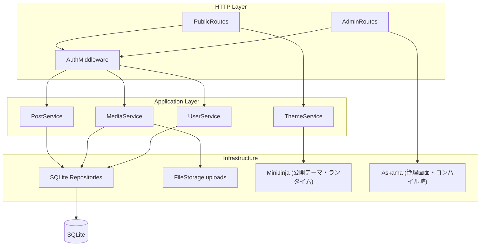
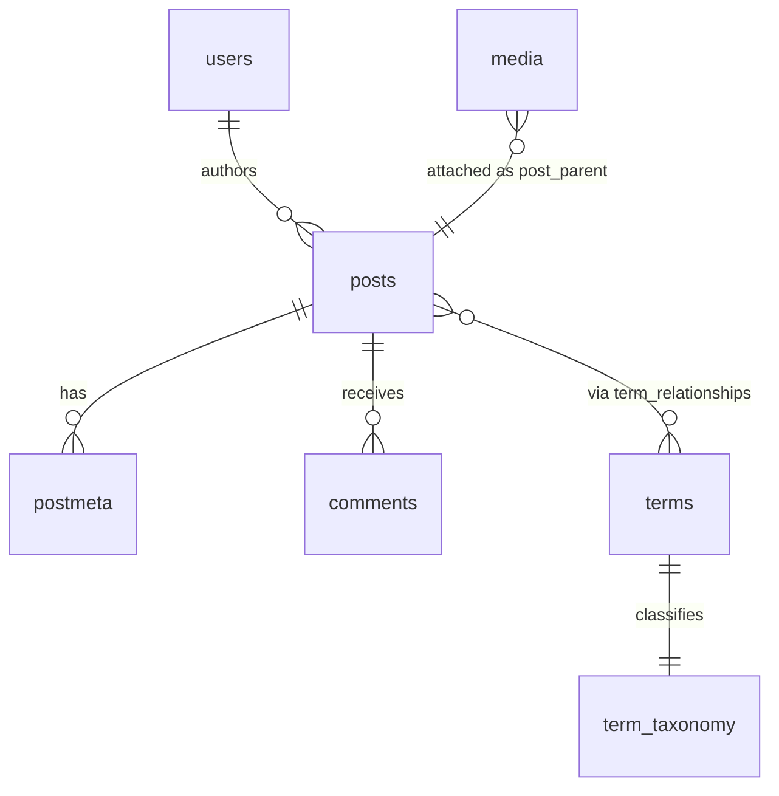
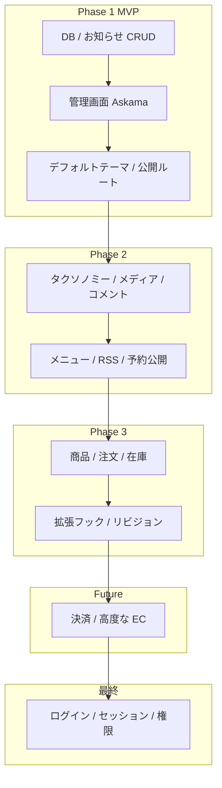

# rust-sqlite-cms 実装計画

本ドキュメントは開発者向けの設計・ロードマップです。
利用方法は [README.md](../README.md) を参照してください。

## 現状

Phase 1 の**基盤レイヤー**まで実装済みです。`cargo run` で設定読み込み → SQLite プール生成 → マイグレーション適用 → 既定 `options` 投入 → axum サーバー起動までが一連で動作します。初回起動時に `data/cms.db` が自動生成され、コアスキーマ（`users` / `posts` / `options` / `terms` / `comments` など）が作成されます。`http://127.0.0.1:3000/admin` の管理ダッシュボードは `options` 由来のサイト名・説明を表示します。

**直近の実装内容**:

- 設定読み込み（`figment`: デフォルト → `config.toml` → 環境変数 `CMS_*` の優先順）
- SQLite 接続（`sqlx`、`create_if_missing` + 外部キー有効化）と `migrations/` の適用
- コアスキーマの初期マイグレーション（`migrations/0001_init.sql`）
- `options` リポジトリと起動時の既定値投入（`blogname` / `blogdescription` / `siteurl` / `active_theme` / `permalink_structure`）
- `AppState`（プール + 設定）の配線と、ダッシュボードの実データ接続
- モジュール分割（`config` / `db` / `error` / `models` / `repos` / `state`）

**未実装（次の予定）**: お知らせ・固定ページの CRUD、デフォルトテーマと公開ルート。詳細は[ロードマップ](#ロードマップ)を参照。

## 設計思想

| 方針 | 内容 |
|------|------|
| メイン用途 | 一般的なホームページのお知らせ欄などを、ユーザーがお手軽に更新できること |
| 将来の拡張 | 商品管理・注文・在庫など EC サイト構築機能への独自進化 |
| 管理画面 | **Askama SSR**（JavaScript フレームワークに依存しない） |
| 公開 API | **非対応**（HTML フォーム + SSR が中心） |
| データベース | SQLite（シンプルな単一ファイル運用） |

## アーキテクチャ

リクエストは HTTP 層 → アプリケーション層（サービス）→ インフラ層（リポジトリ・ファイル・テンプレート）の順で処理します。



### レイヤーの責務

- **routes**: ルーティング、リクエストのパース、レスポンス形式の選択
- **services**: ビジネスルール、権限（capabilities）チェック、トランザクション境界
- **repos**: SQL とモデル間のマッピング（1 テーブル ≈ 1 リポジトリを目安）
- **auth**: セッション、ロール、 capability の解決
- **themes / templates**: テンプレートのレンダリング（公開サイトは MiniJinja でランタイム評価、管理画面は Askama でコンパイル時検証）

## 技術スタック

凡例: ✅ 採用・導入済み / ⏳ 予定

| 用途 | クレート | 状態 | 備考 |
|------|----------|------|------|
| HTTP | `axum` + `tokio` | ✅ | 軽量・型安全 |
| DB | `sqlx`（sqlite, バンドル） | ✅ | マイグレーションは `migrations/` の手書き SQL（`sqlx::migrate!`） |
| テンプレート（管理画面） | `askama` | ✅ | コンパイル時テンプレート検証（テーマ切替の影響を受けない） |
| テンプレート（公開サイト） | `minijinja` + `minijinja-autoreload` | ✅ | ランタイム評価。`themes/` 配下を監視し、ファイル編集・テーマ切替を再起動なしで反映 |
| 設定 | `figment` + `serde` | ✅ | TOML + 環境変数（`CMS_*`） |
| ログ | `tracing` + `tracing-subscriber` | ✅ | 構造化ログ |
| 日時 | `chrono` | ✅ | 予約投稿など |
| エラー | `thiserror` + `anyhow` | ✅ | `AppError` で集約し `IntoResponse` |
| 認証 | `tower-sessions` + `argon2` | ⏳ | セッション Cookie（全機能実装後） |
| スラッグ | `slug` | ⏳ | パーマリンク用 |

- **Rust edition**: `2024`（Rust **1.85 以降**を想定）
- **データベース**: SQLite 3

## ディレクトリ構成（目標形）

```
rust-sqlite-cms/
├── README.md
├── doc/
│   └── PLAN.md              # 本ドキュメント（設計・ロードマップ）
├── Cargo.toml
├── config.example.toml      # 設定のサンプル（コピーして config.toml へ）
├── migrations/              # SQLite スキーマ（バージョン管理）
├── themes/                  # 公開サイト用テーマ（MiniJinja・ランタイム差し替え）
│   └── default/
│       ├── templates/       # *.html
│       └── assets/          # CSS / JS（静的配信）
├── uploads/                 # メディア実体（.gitignore 対象）
└── src/
    ├── main.rs              # 起動・DI・ルーター組み立て
    ├── lib.rs
    ├── config.rs
    ├── error.rs             # AppError → HTTP レスポンス
    ├── db/                  # 接続・マイグレーション
    ├── models/
    ├── repos/
    ├── services/
    ├── auth/
    ├── routes/
    │   ├── public.rs
    │   └── admin/
    └── templates/           # 管理画面用 Askama（テーマと分離）
        └── admin/
```

**テーマと管理 UI の分離**: 公開テーマは `themes/{name}/`、管理画面は `src/templates/admin/` に置きます。サイトの見た目はテーマで切り替え、管理 UI は共通のままです。

## 主要機能

| 機能 | データモデル | フェーズ |
|------|-------------|----------|
| お知らせ・記事 | `posts` テーブル、`post_type = 'post'` | Phase 1 |
| 固定ページ | 同上、`post_type = 'page'`、`parent_id` で階層 | Phase 1 |
| 公開ステータス | `draft` / `publish` / `future` / `trash` | Phase 1 |
| サイト設定 | `options` key-value | Phase 1 |
| テーマ | `themes/` + `active_theme` オプション | Phase 1 |
| ユーザー・ロール | `users` + ロール + capabilities | 最終 |
| カテゴリ・タグ | `terms` + `term_taxonomy` + `term_relationships` | Phase 2 |
| メディアライブラリ | DB メタデータ + `uploads/` ファイル | Phase 2 |
| コメント | `comments`（承認・スパム状態） | Phase 2 |
| ナビゲーションメニュー | `nav_menus` + `nav_menu_items` | Phase 2 |
| RSS | `/feed/` | Phase 2 |
| 予約公開 | `status = future` + 公開日時 | Phase 2 |
| カスタムフィールド | `postmeta` key-value | Phase 1（基本）/ Phase 3（拡張） |
| リビジョン | `post_revisions` | Phase 3 |
| 商品・カタログ | `products` 等（設計中） | Phase 3 |
| 注文・在庫 | `orders` / `order_items` 等（設計中） | Phase 3 |
| 拡張フック | Rust trait / 設定駆動 | Phase 3 |

## データモデル概要

主要エンティティの関係（簡略）:



### 主要テーブル（予定）

| テーブル | 用途 |
|----------|------|
| `posts` | お知らせ・固定ページ・添付のメタ行（`post_type`, `post_status`, `post_author`, `post_parent`, `post_name` など） |
| `postmeta` | カスタムフィールド（key-value） |
| `users` | ユーザーアカウント |
| `usermeta` | ユーザーメタ |
| `options` | サイト設定（`siteurl`, `blogname`, `permalink_structure`, `active_theme` など） |
| `terms` | ターム名・スラッグ |
| `term_taxonomy` | タクソノミー種別（`category`, `post_tag`, …） |
| `term_relationships` | お知らせとタームの関連 |
| `comments` | コメント本文・承認状態 |
| `post_revisions` | 本文リビジョン（Phase 3） |

### SQLite スキーマ方針

- 型は `INTEGER PRIMARY KEY`, `TEXT`, 必要に応じて `JSON`
- 外部キーで参照整合性を担保
- 全文検索は Phase 1 では `LIKE`、将来 **FTS5** を検討

## 権限モデル

ロールと capability による権限管理です。認証実装時に各 `Service` メソッドの先頭で検証します。

| ロール | 概要 |
|--------|------|
| **Administrator** | すべての管理操作 |
| **Editor** | 他人のコンテンツの編集・公開 |
| **Author** | 自分のコンテンツの作成・公開 |
| **Contributor** | コンテンツの作成（公開は不可） |
| **Subscriber** | コメント・プロフィールのみ |

Capability の例: `edit_posts`, `publish_posts`, `edit_others_posts`, `manage_options`, `moderate_comments`

## ルーティング（予定）

公開サイトと管理画面向けの HTML ルートを提供します。

### 公開サイト

| メソッド | パス | 内容 |
|----------|------|------|
| GET | `/` | トップページ（お知らせ一覧など） |
| GET | `/{year}/{month}/{day}/{slug}/` | お知らせ詳細（パーマリンク設定で変化） |
| GET | `/page/{slug}/` | 固定ページ |
| GET | `/category/{slug}/` | カテゴリ一覧 |
| GET | `/tag/{slug}/` | タグ一覧 |
| GET | `/feed/` | RSS（Phase 2） |
| GET | `/shop/` | 商品一覧（Phase 3） |
| GET | `/shop/{slug}/` | 商品詳細（Phase 3） |

### 管理画面（Askama）

認証導入まではログインなしでアクセスできます。`/admin/login` は全機能実装後に有効化します。

| メソッド | パス | 内容 |
|----------|------|------|
| GET | `/admin` | ダッシュボード（実装済み） |
| GET, POST | `/admin/login` | ログイン（最終フェーズ） |
| GET, POST | `/admin/posts`, `/admin/posts/new`, `/admin/posts/{id}/edit` | お知らせ CRUD |
| 同様 | `/admin/pages`, `/admin/media`, `/admin/users`, `/admin/settings`, `/admin/comments` | 各リソース管理 |
| 同様 | `/admin/products`, `/admin/orders` | 商品・注文管理（Phase 3） |

## ロードマップ



### Phase 1（MVP）

進捗凡例: `[x]` 完了 / `[~]` 一部 / `[ ]` 未着手

- [x] SQLite マイグレーション（`migrations/0001_init.sql` でコアスキーマを作成）
- [x] サイト基本設定（`options` テーブル + 起動時の既定値投入）
- [~] 管理画面（Askama）（ダッシュボードのみ。各リソース画面は未実装）
- [ ] お知らせ・固定ページの CRUD（公開・下書き）（**次の予定**）
- [ ] デフォルトテーマと公開ルート

**次の予定（優先順）**:

1. お知らせ・固定ページ CRUD — `posts` の作成・編集・公開/下書き・一覧（`/admin/posts`, `/admin/pages`）、スラッグ生成
2. デフォルトテーマと公開ルート — `themes/default/` と `/`・お知らせ詳細の表示
3. 管理画面の各リソース画面 — メディア・設定・コメントなど（Phase 2 以降と並行）

### Phase 2

- カテゴリ・タグ
- メディアライブラリ（アップロード・添付）
- コメント（モデレーション）
- ナビゲーションメニュー
- RSS フィード
- 予約公開

### Phase 3

- 商品カタログ（SKU・価格・画像）
- カート・注文・在庫管理
- リビジョン
- カスタムフィールドの拡張
- Rust ベースの拡張フック

### Future（低優先）

- 決済サービス連携
- FTS5 による全文検索
- 配送・税率など EC 周辺機能

### 最終

- ユーザー・ログイン（`tower-sessions` + argon2）
- ロール / capability と管理画面の認証ミドルウェア
- `/admin/login`・ログアウト

## 開発フロー（予定）

1. （任意）`config.example.toml` を `config.toml` にコピーして編集
2. `cargo run` でサーバー起動
3. ブラウザで `http://127.0.0.1:3000/admin` にアクセス

## セキュリティ上の考慮（設計）

- **XSS**: テンプレートエンジンの自動 HTML エスケープを利用（管理画面: Askama、公開サイト: MiniJinja の `.html` 既定エスケープ）。生 HTML を出す場合は明示的なサニタイズ方針を文書化
- **CSRF**: 管理画面の POST フォームには CSRF トークンを付与
- **認証**: パスワードは argon2 でハッシュ。セッション Cookie は HttpOnly / Secure（本番）を推奨
- **アップロード**: MIME 検証、サイズ上限、実行可能拡張子の拒否

## 非目標（Non-Goals）

以下は**スコープ外**または**初期バージョンでは対応しない**ものです。

- JavaScript フレームワークによる管理画面（Askama SSR を維持）
- 外部 REST API の公開（HTML フォーム + SSR が中心）
- マルチテナント / 大規模 SaaS 運用
- MySQL / PostgreSQL など SQLite 以外のデータベース
