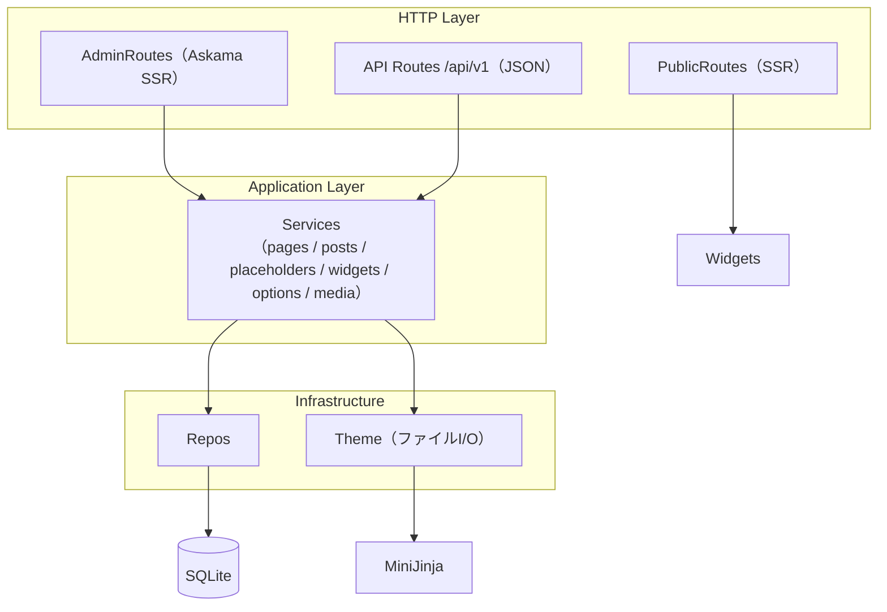
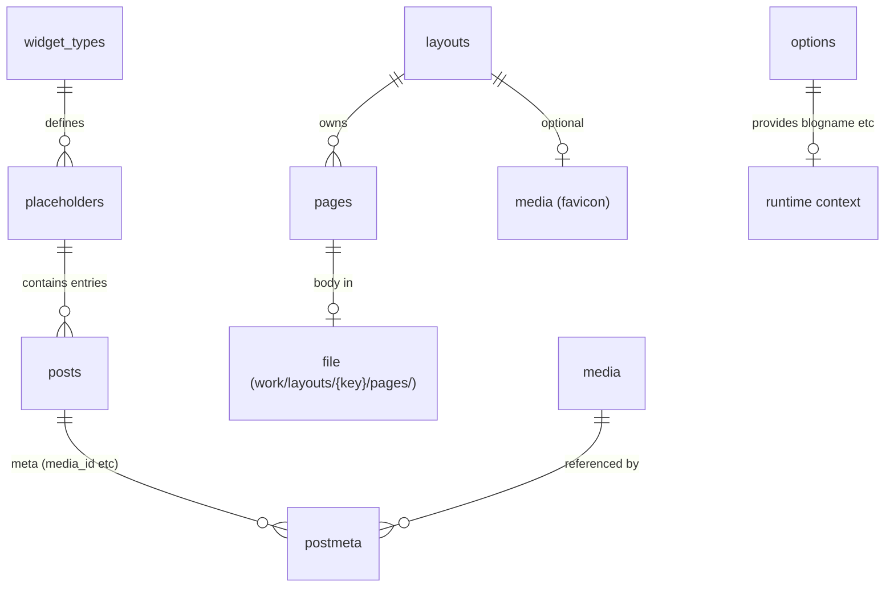
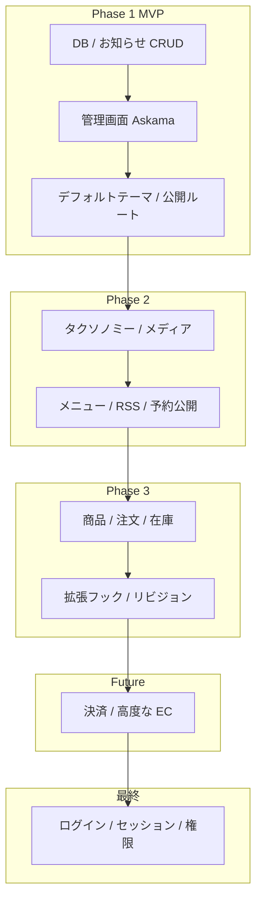

# rust-sqlite-cms 実装計画

本ドキュメントは開発者向けの設計・ロードマップです。
利用方法は [README.md](../README.md) を参照してください。

## 現状

Phase 1 のコンテンツ管理機能（ページ + ウィジェット） + レイアウト基盤（Phase A/B） + メディアライブラリ + 画像カルーセルウィジェット + ウィジェット配布 まで実装済みです。`cargo run` で設定読み込み → SQLite プール生成 → マイグレーション適用（`migrations/0001_init.sql`） → 既定 `options` 投入 → 既定ユーザー確認 → `work/` ディレクトリ初期化（`theme::ensure_seeded` で `work/layouts/default/` の shell/pages/static seed + legacy 移行、既定レイアウト行確保、 `media::ensure_uploads_dir`、 `pages::ensure_index_page`） → axum サーバー起動までが一連で動作します。初回起動時に `data/cms.db`（親 dir 含め）が自動生成されます。開発用の `cargo run -- --test` では `admin` のパスワードを常に `testpass` に固定します。サンプルデータは `/admin/samples` からリセット/追記可能。

**利用可能な主な機能**:

- 公開サイト: `http://127.0.0.1:3000/` で企業ホームページサンプル表示（MiniJinja テンプレート + `news` / `main_carousel` プレースホルダー由来の動的ブロック）。公開済みページは任意 URL パスでフォールバック配信（`/static/{layout_key}/*` で静的アセット、既定レイアウトの `/favicon.ico` も対応）。
- 管理ダッシュボード: `/admin`（`options` 由来のサイト名・説明 + 各管理へのカードリンク）
- レイアウト管理: `/admin/layouts` で shell.html 編集、static ファイルのアップロード/削除、favicon メディア選択、所属ページ確認（`work/layouts/{key}/` 構造）。詳細は [LAYOUT_SPEC.md](./LAYOUT_SPEC.md)
- ページ管理: `/admin/pages` でサイトページ CRUD。レイアウト選択 + プリセット（ランディング/シンプルページ/お知らせ一覧）からの作成、MiniJinja テンプレート編集、URL パス割り当て、公開/非公開、トップページ特別扱い、プレビュー（編集モードでウィジェット注釈付き `/admin/pages/{id}/preview`）
- 投稿/お知らせ管理: `/admin/posts` でプレースホルダー（テンプレート変数名）の定義と、各プレースホルダー配下のエントリ CRUD（投稿タブ + 設定タブの統合管理画面）。ゴミ箱（trash ステータス、一覧・復元・完全削除）対応
- ウィジェット: `/admin/widgets` で HTML 構成（`html_template`）とインスタンス設定スキーマ（`config_schema`）を編集・保存。news / image / carousel などがプリセット済み。JSON パッケージのエクスポート/インポートで他サイトとタイプ定義を共有可能。各ページへの配置はプレースホルダー（`/admin/posts`）でインスタンスを作り、テンプレートに `{{ 名前_html | safe }}` を書くだけ
- メディアライブラリ: `/admin/media` で画像・ファイルのアップロード・一覧（プレビュー付き）・削除。image ウィジェットや carousel ウィジェットのスライドで `postmeta` + メディア添付として利用
- サンプルデータ: `/admin/samples` で開発用テストデータの投入（基本リセット / 追記）。カルーセル画像入りデモなどを簡単に再現
- サイト設定: `/admin/settings` でサイト名・説明・サイト URL（`options` + `work/config.toml` の `[site]` 同期）
- ユーザー管理: `/admin/users` で管理ユーザーの CRUD（既定の `admin` は削除不可）
- 作業ディレクトリ: `work/layouts/{key}/`（shell・pages・static）。`work/uploads/` 配下にメディア実体
- REST API（`/api/v1`）: レイアウト・プレースホルダー・投稿・ページ・ウィジェット・メディア・設定の JSON 操作（Cookie セッション認証）。セッション API は認証不要

**実装済みの技術的特徴**:

- コンテンツウィジェット（お知らせ・画像・カルーセル）は **ウィジェットタイプ**（HTML 構成の定義）→ **プレースホルダー**（ページごとのインスタンス + 設定）→ **エントリ**（`posts` + `postmeta` for media） の 3 層。詳細は [ウィジェット体系](#ウィジェット体系)。
- 公開ページの本文はファイル（`work/layouts/{key}/pages/*.html` など、常に MiniJinja 評価）、メタ情報（URL・公開フラグ・layout_id）は `pages` テーブル + `layouts` テーブルで管理。`is_static` 廃止（LAYOUT_SPEC 移行済み）。
- 管理画面は Askama（コンパイル時型安全）、公開サイトは MiniJinja + `minijinja-autoreload`（ファイル編集で再起動不要で反映）。
- 静的アセットは `work/layouts/{key}/static/` を `/static/{key}/*` で配信（レイアウト名前空間分離）。
- サービス層導入済み（`src/services/`）。HTML 管理画面と JSON API が同じ業務ロジックを共有。管理画面（`/admin/*`）と REST API（`/api/v1/*`、セッション API を除く）に認証ミドルウェアを適用済み。同一の `tower-sessions` Cookie を共有。
- ウィジェットエクスポート/インポート（`WidgetPackage` JSON）、メディア管理、レイアウト CRUD、ページプレビュー、投稿ゴミ箱、サンプルリセット機能を実装。

**未実装（主なもの）**: ロール/capability による細かい権限制御、タクソノミー（カテゴリ/タグ）など。詳細は[ロードマップ](#ロードマップ)を参照。

## 設計思想

| 方針 | 内容 |
|------|------|
| メイン用途 | 一般的なホームページのお知らせ欄などを、ユーザーがお手軽に更新できること |
| ウィジェット | HTML 構成を編集可能な再利用コンポーネント。タイプを保存し配布・共有し、インスタンス設定は各ページ（プレースホルダー）で調整して簡単に配置 |
| 将来の拡張 | 商品管理・注文・在庫など EC サイト構築機能への独自進化 |
| 管理画面 | **Askama SSR**（JavaScript フレームワークに依存しない） |
| 公開 API | **管理用 REST/JSON API 対応**（`/api/v1` でプレースホルダー/投稿/ページ/ウィジェット/設定/メディアを操作可能。将来的な CLI・モバイルクライアント向け） |
| データベース | SQLite（シンプルな単一ファイル運用） |

## アーキテクチャ

Phase 1.5 以降の構成です。リクエストは HTTP 層（axum handlers）からサービス層を経由してリポジトリとテーマ/ウィジェット層を呼び出します。サービス層・認証ミドルウェアは導入済み。レイアウト基盤（`migrations/0001_init.sql` の `layouts` / `pages` スキーマ）により公開ページ構造が `layouts` + `work/layouts/{key}/` に再編されました。

```mermaid
flowchart TB
  subgraph http [HTTP Layer]
    PublicRoutes[PublicRoutes + fallback]
    AdminRoutes[AdminRoutes<br/>(posts / pages / widgets)]
  end
  subgraph app [Application（薄い）]
    Widgets[Widgets context builder<br/>(placeholders + posts → MiniJinja vars)]
  end
  subgraph infra [Infrastructure]
    Repos[SQLite Repositories<br/>(options / pages / placeholders / posts / widget_types)]
    Theme["Theme (MiniJinja autoreload + work/ I/O)"]
    Askama["Askama (管理画面・コンパイル時)"]
  end
  PublicRoutes --> Widgets
  PublicRoutes --> Theme
  AdminRoutes --> Repos
  AdminRoutes --> Theme
  Widgets --> Repos
  Theme --> MiniJinja[(MiniJinja)]
  Repos --> SQLite[(SQLite)]
```

### レイヤーの責務（Phase 1.5 実装時点）

- **routes**: ルーティング、リクエストのパース、フォーム処理、レスポンス（Html / Redirect）。バリデーションとエラーフォーム再描画もここで。admin に layouts / media / samples / preview ルート追加。
- **repos**: SQL とモデル間のマッピング + ビジネス寄りのクエリ。1 テーブル ≈ 1 リポジトリ（options / pages / placeholders / posts / widget_types / layouts / media / users / postmeta / url_paths など）。
- **theme**: `work/` ディレクトリの初期化・I/O（`ensure_seeded` + read/write/remove for layouts/{key}/shell/pages/static）、MiniJinja エンジン（autoreload）。`work/layouts` ルート。
- **widgets**: プレースホルダー解決、`html_template` のサーバーサイドレンダリング（news/image/carousel 対応）、公開サイト向けコンテキスト構築（`{{ news_html }}` / `main_carousel_html` / `has_*` などの変数 + media URL 解決）。
- **templates**: 管理画面は `src/templates/admin/` の Askama（型安全）、公開は `work/layouts/{key}/` の MiniJinja（ランタイム差し替え可能）。
- **services / auth**: サービス層を導入済み（`src/services/` for pages/posts/placeholders/widgets/options/media/layouts/users）。HTML 管理画面と JSON API が同じ業務ロジックを共有。管理画面（`/admin/*`）と REST API（`/api/v1/*`、セッション API を除く）に認証ミドルウェアを適用済み。同一の `tower-sessions` Cookie を共有。`src/dev/reset.rs` でサンプルデータ操作。
- **media**: アップロードディレクトリ管理、MIME/ファイルハンドリング、`postmeta` 経由のウィジェット添付（`src/media/` + repos/services/routes）。
- **layouts**: レイアウト CRUD、ファイル I/O 連携、favicon 解決、既定レイアウト保証（`src/routes/admin/layouts.rs` + services + repos）。

### Phase 1.5 以降のアーキテクチャ（API 導入後）

サービス層の導入により、HTML クライアント（Askama SSR）と JSON API クライアントが同じコアロジックを利用する形になりました。




## 技術スタック

凡例: ✅ 採用・導入済み / ⏳ 予定

| 用途 | クレート | 状態 | 備考 |
|------|----------|------|------|
| HTTP | `axum` + `tokio` | ✅ | 軽量・型安全 |
| DB | `sqlx`（sqlite, バンドル） | ✅ | マイグレーションは `migrations/0001_init.sql` の手書き SQL（統合初期スキーマ、`sqlx::migrate!`） |
| テンプレート（管理画面） | `askama` | ✅ | コンパイル時テンプレート検証（公開テンプレートの影響を受けない） |
| テンプレート（公開サイト） | `minijinja` + `minijinja-autoreload` | ✅ | ランタイム評価。`work/layouts/{key}/` 配下を監視し、ファイル編集を再起動なしで反映（`theme::layouts_dir`） |
| 静的配信 | `tower-http`（ServeDir） | ✅ | `work/layouts/{key}/static/*` を `/static/{key}/*` で配信（レイアウト名前空間） |
| 設定 | `figment` + `serde` | ✅ | TOML + 環境変数（`CMS_*`）。優先順: デフォルト → work/config.toml → 環境変数 |
| ログ | `tracing` + `tracing-subscriber` | ✅ | 構造化ログ |
| 日時 | `chrono` | ✅ | 作成・更新・公開日時 |
| エラー | `thiserror` + `anyhow` | ✅ | `AppError` で集約し `IntoResponse` |
| ウィジェット/コンテキスト | `serde_json` | ✅ | プレースホルダー解決と MiniJinja 渡し用 |
| 認証 | `tower-sessions` + `argon2` | ✅ | 管理画面（`/admin/*`）と REST API（`/api/v1/*`）のセッション Cookie ログイン（共有） |
| スラッグ生成 | （自前実装） | ✅ | `posts.rs` 内の簡易 slugify（`slug` クレート未使用） |

- **Rust edition**: `2024`（Rust **1.85 以降**を想定）
- **データベース**: SQLite 3

## ディレクトリ構成（現在の形）

```
rust-sqlite-cms/
├── README.md
├── doc/
│   ├── PLAN.md              # 本ドキュメント（設計・ロードマップ）
│   └── LAYOUT_SPEC.md       # レイアウト再編の詳細設計（Phase A/B 実装済み）
├── Cargo.toml
├── config.example.toml      # 設定のサンプル（初回起動で work/config.toml へコピー）
├── migrations/              # SQLite スキーマ（0001_init.sql：統合初期スキーマ）
├── presets/                 # 同梱スターターデザイン（git 管理・seed 元）
│   ├── shell.html           # 既定レイアウト shell（HEAD/nav/footer + extends ブロック）
│   ├── home_page.html       # トップページ本文（carousel + news ウィジェット使用例）
│   ├── default/site.css     # 既定レイアウト CSS
│   ├── landing.html / simple-page.html / news.html  # ページ本文プリセット
│   └── pages/               # プリセット本文群
├── work/                    # ステートフル作業ディレクトリ（.gitignore 対象）
│   ├── config.toml          # 実行時設定（初回は config.example.toml から生成）
│   ├── layouts/
│   │   └── default/         # 既定レイアウト（key == 'default'）
│   │       ├── shell.html   # 共通枠（MiniJinja、 など）
│   │       ├── static/      # レイアウト専用 CSS/JS（/static/default/* で配信）
│   │       └── pages/
│   │           └── index.html  # トップ（url_path='/'）
│   └── uploads/             # メディア実体（config.paths.uploads_dir 配下、年/月 構造も可）
└── src/
    ├── main.rs              # 起動・DI・ルーター組み立て + 初期化（ensure_seeded, layouts::find_default, media ensure など）
    ├── lib.rs
    ├── config.rs            # figment 設定（Server/DB/Paths/Site/Session/Security）。uploads_dir 既定 "work/uploads"
    ├── error.rs             # AppError → HTTP レスポンス
    ├── db/                  # 接続・マイグレーション（sqlx::migrate! で全 migrations/ 適用）
    ├── models/              # Page / Post / Placeholder / WidgetType / OptionRow / Layout / Media / User など
    ├── presets.rs           # プリセット定義（DEFAULT_SHELL / DEFAULT_HOME_PAGE / PRESETS）
    ├── repos/               # options / pages / placeholders / posts / widget_types / layouts / media / users / postmeta / url_paths ...
    ├── services/            # pages / posts / placeholders / widgets / options / media / layouts / users（業務ロジック共通化）
    ├── theme/               # MiniJinja エンジン + work/layouts/ ファイル I/O（ensure_seeded, read/write shell/page/static, legacy migrate）
    ├── widgets/             # build_render_context（プレースホルダー解決 + carousel/image/news レンダリング + media URL）
    ├── media/               # アップロードユーティリティ
    ├── dev/                 # reset.rs（サンプルデータ投入ロジック）
    ├── routes/
    │   ├── public.rs        # / + fallback + /static/{*path} + /favicon.ico
    │   ├── admin/           # posts / pages / layouts / widgets / media / samples / settings / users / auth + dashboard
    │   ├── api/             # /api/v1 ルータ
    │   └── url.rs           # URL 正規化・予約パス判定
    ├── api/v1/              # layouts / media / pages / placeholders / posts / widgets / settings / session
    └── templates/           # 管理画面用 Askama（公開と完全分離）
        └── admin/
            ├── base.html    # サイドバー（投稿/ページ/レイアウト/ウィジェット/メディア/サンプル/ユーザー/設定）
            ├── dashboard.html
            └── ...
```

**公開ページと管理 UI の分離**: 公開 HTML は `work/layouts/{key}/pages/*.html`（常に MiniJinja、通常 `` + ``）に本文を置き、`pages` テーブル（+ `layouts`）に URL・公開フラグ・layout_id・file_name 等のメタ情報を保持します。`is_static` 廃止・`work/templates`/`work/pages` 二重構造は移行済み（LAYOUT_SPEC 参照）。管理画面は `src/templates/admin/` の Askama に置き、公開ページの影響を受けません。MiniJinja ページは再起動不要で即反映。`work/uploads/` はメディア実体用。

## ウィジェット体系

ウィジェットは「見た目とマークアップの型」を定義する再利用可能なコンポーネントです。**HTML 構成（MiniJinja 断片）の編集**と**ページごとのインスタンス設定**を分離し、同じウィジェットを複数ページに簡単に載せられるようにします。

### 2 層の編集責務

| 層 | 管理画面 | 保存先 | 役割 |
|----|----------|--------|------|
| **ウィジェットタイプ** | `/admin/widgets` | `widget_types`（`html_template`, `config_schema`, `config`） | ウィジェットの HTML 構成・利用可能なインスタンス設定項目の定義。ここで作った型はサイト内で保存され、編集内容は DB に永続化される |
| **プレースホルダー（インスタンス）** | `/admin/posts`（プレースホルダー作成 + 設定タブ） | `placeholders`（`name`, `config` JSON）+ 紐づく `posts` | あるウィジェットタイプの**1 つの利用単位**。表示件数・見出しなどインスタンス固有の値をここで調整。エントリ（お知らせ本文など）もこの配下で CRUD |

- ウィジェット画面: **どう描画するか**（HTML テンプレート + 設定フォームのスキーマ）
- 投稿（プレースホルダー）画面: **このページ用にどう使うか**（インスタンス設定 + コンテンツ）

`config_schema`（JSON）で定義した項目は、プレースホルダー編集画面の設定タブで入力欄が自動生成されます（例: 表示件数 `limit`）。

### ページへの配置

公開ページの MiniJinja テンプレート（`work/layouts/{key}/pages/*.html` など、通常 shell を extends）に、プレースホルダー名に対応する変数を 1 行書くだけで配置できます。

- **推奨**: `{{ news_html | safe }}` または `{{ main_carousel_html | safe }}` — サーバーでレンダリング済みの HTML 断片を差し込む
- **後方互換 / 追加変数**: `{{ news }}` / `` や carousel 用の `carousel.slides` / `has_carousel` なども利用可能
- ウィジェット内でメディアを使用する場合、image/carousel エントリは `postmeta`（media_id 等）経由で `uploads/` の公開 URL を解決

ページ管理（`/admin/pages`）でテンプレート本文を編集し、使いたいプレースホルダー名を埋め込む運用です（レイアウト変更時は shell ブロック名等に注意）。全ページが MiniJinja 評価されるため（is_static 廃止）、ウィジェット配置はどのページでも可能。

### 保存・配布・共有

| 項目 | 状態 |
|------|------|
| ウィジェットタイプの編集と DB への保存 | ✅ `/admin/widgets` で `html_template` / `config_schema` を更新 |
| REST API による参照・更新 | ✅ `/api/v1/widgets`（一覧・`config` / `html_template` の PATCH） |
| パッケージのエクスポート / インポート、他サイト・他ユーザーへの配布 | ✅ JSON パッケージ（`format_version: 1`）。管理画面（一覧インポート・各行/編集画面エクスポート）と `/api/v1/widgets/{type_key}/export`・`POST /api/v1/widgets/import` |

完成したウィジェット（タイプ定義 + 必要なら既定スキーマ）は、まず自サイトの `widget_types` として保持します。`WidgetPackage`（`type_key`, `label`, `description`, `config`, `html_template`, `config_schema`）を JSON でエクスポートし、別インストールへインポートして同じ HTML 構成を再現できます。カスタム `type_key` の新規登録にも対応（汎用レンダリングは `config` + `html_template`）。

### データの流れ（公開時）

```mermaid
flowchart LR
  WT[widget_types<br/>html_template]
  PH[placeholders<br/>config + name]
  PO[posts<br/>entries + postmeta for media]
  PG[page template<br/>work/layouts/{key}/pages/...]
  WT --> Render[widgets レンダリング（news/image/carousel）]
  PH --> Render
  PO --> Render
  Media[media テーブル + uploads/ 実体] --> Render
  Render --> Vars["MiniJinja 変数<br/>例: news_html, has_news, main_carousel_html, carousel.slides, item.image_url"]
  Vars --> PG
  PG --> HTML[公開 HTML]
```

### 実装済みのウィジェット例

- **news**（お知らせ一覧）: プレースホルダー + 投稿エントリ。インスタンス設定で表示件数など。サンプルホームで使用
- **image**（画像・リンク）: プレースホルダー（幅・高さ・object-fit・角丸）+ 画像エントリ（`postmeta` で float / margin 等 + media_id）。メディアライブラリから選択・添付
- **carousel**（画像カルーセル）: 複数のスライド（画像+リンク）。インスタンス設定（interval / width / height）。`postmeta` でメディア添付、JS による自動スライド/ドット/ボタン実装済み（プリセット済み widget_type + ホームサンプルで `main_carousel` 使用）。メディアアップロードと連動

## 主要機能

| 機能 | データモデル | フェーズ | 状態 |
|------|-------------|----------|------|
| お知らせ（ニュースウィジェット） | `placeholders` + `widget_types`（JSON config） + `posts`（`placeholder_id` 紐付け、status=draft/publish） | Phase 1 | ✅ 実装済み（/admin/posts） |
| 投稿ゴミ箱（一覧・復元・完全削除） | `posts.post_status = trash`（ソフト削除） | Phase 1 | ✅（/admin/posts/trash。REST API は未提供） |
| サイトページ（トップ・テンプレート） | `pages` テーブル + `layouts`（layout_id 必須） + `work/layouts/{key}/pages/*.html`（常に MiniJinja） | Phase 1 + A/B | ✅ 実装済み（/admin/pages + プリセット、プレビュー付き）。is_static 廃止 |
| 公開ステータス | `posts.post_status`（draft/publish/trash）、`pages.is_published` | Phase 1 | ✅ |
| サイト設定（key-value） | `options` テーブル | Phase 1 | ✅ |
| ウィジェット（HTML 構成・型定義） | `widget_types`（`html_template`, `config_schema`, `config`） | Phase 1 | ✅（/admin/widgets） |
| ウィジェットインスタンス（ページごとの設定・配置） | `placeholders.config` + テンプレートへの `{{ *_html }}` | Phase 1 | ✅（/admin/posts + `/admin/pages` テンプレート編集） |
| ウィジェットのエクスポート / 配布・共有 | `WidgetPackage` JSON | Phase 2 | ✅（管理画面 + `/api/v1/widgets/.../export` + import） |
| レイアウト管理（shell / static / favicon / ページ所属） | `layouts` テーブル + `work/layouts/{key}/`（shell/static/pages） | Phase 2 候補（A/B 前倒し） | ✅ 実装済み（/admin/layouts CRUD + ファイル編集 + 静的アップロード + favicon メディア選択） |
| メディアライブラリ | `media` テーブル（メタ） + `uploads/` ファイル実体 + `postmeta` 紐付け | Phase 2 | ✅ 実装済み（/admin/media アップロード/一覧/削除、image/carousel から利用） |
| 画像カルーセルウィジェット | 専用 widget_type（`carousel`） + スライド用 posts + postmeta（media） + インスタンス config（interval 等） + 内蔵 JS/CSS | Phase 2（前倒し） | ✅ 実装済み（プリセット済み、ホームで `main_carousel` 使用、メディア連動） |
| サンプルデータ投入 | `dev/reset.rs` + `/admin/samples`（reset/append） | - | ✅ 実装済み（news + carousel 画像入りデモなど） |
| ユーザー・ロール | `users` + ロール + capabilities | 最終 | 未着手（スキーマ未導入、基本 CRUD のみ） |
| カテゴリ・タグ | `terms` + `term_taxonomy` + `term_relationships` | Phase 2 | 未着手（スキーマ未導入） |
| ナビゲーションメニュー | `nav_menus` + `nav_menu_items` | Phase 2 | 未着手 |
| RSS | `/feed/` | Phase 2 | 未着手 |
| 予約公開 | `status = future` + 公開日時 | Phase 2 | 未着手 |
| カスタムフィールド | `postmeta` key-value | Phase 1（基本）/ Phase 3（拡張） | ✅（画像ウィジェット・carousel・メディア添付で積極利用） |
| リビジョン | `post_revisions` | Phase 3 | 未着手 |
| 商品・カタログ | `products` 等（設計中） | Phase 3 | 未着手 |
| 注文・在庫 | `orders` / `order_items` 等（設計中） | Phase 3 | 未着手 |
| 拡張フック | Rust trait / 設定駆動 | Phase 3 | 未着手 |

## データモデル概要

`migrations/0001_init.sql`（ウィジェット/投稿/オプション/ユーザー + `layouts` / `pages`（`layout_id` 必須・`is_static` なし）/ `favicon_media_id` + news/image/carousel シード）が現在のデータモデル基盤です（`users` / タクソノミー系は未導入。将来フェーズで追加予定）。`layouts` + `media` + `postmeta` が積極的に使われています。

**主な関係（実装済み部分）**:



### 主要テーブル（現在の利用状況）

| テーブル | 用途 | 利用状況 |
|----------|------|----------|
| `options` | サイト設定（`blogname`, `blogdescription`, `siteurl` など） | ✅ 積極利用（起動時既定投入 + 公開コンテキスト + settings 同期） |
| `layouts` | レイアウト定義（`key`, `name`, `is_default`, `favicon_media_id`）。1 サイトに 1 つ以上のレイアウト、ちょうど 1 つの既定 | ✅ 積極利用（/admin/layouts、ページ所属、shell 配信、favicon） |
| `pages` | 公開ページのメタ（`name`, `url_path`, `file_name`（レイアウト内相対）、`layout_id`（必須）、`is_published`）。本文は `work/layouts/{key}/pages/` に分離保存（常に MiniJinja） | ✅ 積極利用（全ページ CRUD + プレビュー + ホーム特別扱い） |
| `widget_types` | ウィジェット種類（`type_key`）、HTML 構成（`html_template`）、インスタンス設定スキーマ（`config_schema`）、型共通の `config` | ✅ 積極利用（/admin/widgets + 描画時レンダリング）。news/image/carousel シード済み |
| `placeholders` | ページに載せるインスタンス（`name` = テンプレート変数名、`config` = インスタンス設定 JSON）。`widget_type_id` で型を指定 | ✅ 積極利用（/admin/posts：設定タブ + エントリ CRUD） |
| `posts` | お知らせエントリ（`placeholder_id` 紐付け）およびメディア添付（`post_type = attachment`） | ✅ 積極利用（draft/publish/trash） |
| `postmeta` | 画像/カルーセル用（`media_id` / `float` / `margin` / link_url など）や添付ファイルメタ | ✅ 積極利用（ウィジェット + メディア連携） |
| `media` | メディアメタデータ（mime、サイズ、file_path など）。`post_type=attachment` の posts と 1:1 相当 | ✅ 積極利用（/admin/media + ウィジェット添付） |
| `users` | 管理ユーザー（login, password_hash, role） | ✅ 利用（ログイン・ユーザ管理画面） |

### SQLite スキーマ方針

- 型は `INTEGER PRIMARY KEY`, `TEXT`, 必要に応じて `JSON`（config など）
- 外部キーで参照整合性を担保（`placeholder_id`, `layout_id`, `post_id` など）
- マイグレーションは `migrations/0001_init.sql` の単一ファイル（ウィジェット体系・投稿・オプション・ユーザー + `layouts` / `pages` 最終形 + news/image/carousel シード）。`sqlx::migrate!` で自動適用
- 全文検索は Phase 1 では `LIKE`、将来 **FTS5** を検討
- スキーマ変更後は既存 `data/cms.db` を削除して再生成（`sqlx::migrate!` のチェックサム検証のため）
（従来予定の `post_type` による pages/posts 統一モデルは、Phase 1 実装で `pages`（サイト構造 + layouts 所属） + ウィジェット用 `posts` に分離・進化しました。レイアウト移行は LAYOUT_SPEC.md 参照。）

## 権限モデル

ロールと capability による権限管理です。認証実装時に各 `Service` メソッドの先頭で検証します。

| ロール | 概要 |
|--------|------|
| **Administrator** | すべての管理操作 |
| **Editor** | 他人のコンテンツの編集・公開 |
| **Author** | 自分のコンテンツの作成・公開 |
| **Contributor** | コンテンツの作成（公開は不可） |
| **Subscriber** | プロフィールのみ |

Capability の例: `edit_posts`, `publish_posts`, `edit_others_posts`, `manage_options`

## ルーティング（実装状況）

公開サイトと管理画面向けの HTML ルートを提供します。管理画面（`/admin/login`・`/admin/logout` を除く）はログイン必須です。

### 公開サイト

| メソッド | パス | 内容 | 状態 |
|----------|------|------|------|
| GET | `/` | トップページ（既定レイアウトの index を MiniJinja + widgets コンテキスト（news/carousel）で描画） | ✅ |
| GET | `/{任意パス}` | 公開済みページのフォールバック配信（`pages` テーブルの `url_path`）。レイアウト所属必須 | ✅ |
| GET | `/static/{layout_key}/*` | `work/layouts/{layout_key}/static/` 配下の静的アセット（レイアウト名前空間） | ✅ |
| GET | `/favicon.ico` | 既定レイアウトの `favicon_media_id` からメディア実体を配信（mime 対応） | ✅ |
| GET | `/uploads/*` | `uploads_dir`（既定 work/uploads） 配下のメディア実体を tower-http ServeDir で配信 | ✅ |

（伝統的な `/year/month/slug/` 形式のお知らせ詳細やカテゴリページは未実装。現在の「お知らせ」はウィジェットとしてページ内に埋め込まれる形。）

### 管理画面（Askama）

| メソッド | パス | 内容 | 状態 |
|----------|------|------|------|
| GET | `/admin` | ダッシュボード（サイト名・説明表示 + 各管理へのリンクカード） | ✅ |
| GET, POST | `/admin/posts` | プレースホルダー一覧・作成・編集・削除 | ✅ |
| GET, POST | `/admin/posts/placeholders/{id}` | プレースホルダー管理（インスタンス設定タブ + エントリ一覧） | ✅ |
| GET, POST | `/admin/posts/placeholders/{id}/entries/new` など | エントリ作成・編集 | ✅ |
| GET, POST | `/admin/posts/trash` など | ゴミ箱一覧・復元・完全削除 | ✅（tests/posts_trash.rs） |
| GET, POST | `/admin/pages` | ページ一覧・作成（レイアウト選択 → プリセット選択）・編集・削除（テンプレートへのウィジェット配置） | ✅ |
| GET | `/admin/pages/new/{design}` | プリセット選択後の作成フォーム | ✅ |
| GET | `/admin/pages/{id}/preview` | 編集モード注釈付きプレビュー（widgets annotate） | ✅ |
| GET, POST | `/admin/layouts` | レイアウト一覧・作成・編集・削除（既定ガード） | ✅ |
| ... | `/admin/layouts/{id}` / file edit / static upload/delete / favicon picker | shell.html 編集、static ファイル管理、favicon メディア選択 | ✅（LAYOUT_SPEC Phase A/B） |
| GET, POST | `/admin/widgets` | ウィジェットタイプ一覧・HTML 構成（`html_template`）と `config_schema` の編集 | ✅ |
| GET | `/admin/widgets/{type_key}/export` | ウィジェットタイプの JSON エクスポート | ✅ |
| POST | `/admin/widgets/import` | JSON パッケージのインポート（上書き/スキップ） | ✅ |
| GET, POST | `/admin/media` | メディア一覧・アップロード・削除（カードプレビュー） | ✅ |
| GET, POST | `/admin/samples` | サンプルデータ投入（reset / append フォーム + 結果表示） | ✅（dev/reset.rs 使用） |
| GET, POST | `/admin/login` | ログイン | ✅ |
| POST | `/admin/logout` | ログアウト | ✅ |
| GET, POST | `/admin/settings` | サイト設定（blogname / blogdescription / siteurl） | ✅ |
| GET, POST | `/admin/users` … | 管理ユーザー CRUD | ✅ |

### REST API（JSON）

管理用 `/api/v1` エンドポイント。`/session` を除くすべてのルートはログイン必須（署名 Cookie `cms_session`）。

| メソッド | パス | 内容 | 状態 |
|----------|------|------|------|
| POST | `/api/v1/session` | JSON ログイン（`Set-Cookie`） | ✅ |
| GET | `/api/v1/session` | 現在のログインユーザー取得 | ✅ |
| DELETE | `/api/v1/session` | ログアウト | ✅ |
| * | `/api/v1/*`（上記以外） | レイアウト・プレースホルダー・投稿・ページ・ウィジェット・メディア・設定（全リソース CRUD + エクスポート/インポート） | ✅（認証必須） |

サイドバー（`base.html`）には全管理リンク（レイアウト/メディア/サンプル含む）が実装済みです。

## ロードマップ



### Phase 1（MVP） + レイアウト/メディア前倒し

進捗凡例: `[x]` 完了 / `[~]` 一部 / `[ ]` 未着手

- [x] SQLite マイグレーション（`migrations/0001_init.sql` でウィジェット体系・layouts・pages・favicon を含む統合初期スキーマ）
- [x] サイト基本設定（`options` テーブル + 起動時の既定値投入 + `ensure_defaults`）
- [x] サイト設定画面（`/admin/settings`、`work/config.toml` の `[site]` 同期）
- [x] 管理画面（Askama）（ダッシュボード + 投稿/ページ/レイアウト/ウィジェット/メディア/サンプル/ユーザー管理画面のフル CRUD）
- [x] お知らせ機能（プレースホルダー定義 + エントリ CRUD + ウィジェットレンダリング + `news` / `has_news` コンテキスト提供）
- [x] ページ管理（プリセット選択、レイアウト所属、MiniJinja テンプレート、URL 割り当て・公開制御、トップページ特別扱い、プレビュー）
- [x] レイアウト基盤（A/B）（`layouts` テーブル + `work/layouts/{key}/` seed/I/O/CRUD、shell 編集、static 配信、favicon メディア、pages 統合。is_static 廃止）
- [x] デフォルトテーマと公開ルート（`work/layouts/` seed、MiniJinja autoreload、`/ ` + フォールバック配信、`/static/{key}/*` + favicon + uploads 配信）
- [x] ウィジェット管理（`widget_types` の `html_template` / `config_schema` 編集と保存）。news/image/carousel プリセット
- [x] プレースホルダー単位のインスタンス設定（`placeholders.config`、`config_schema` 連動フォーム）
- [x] メディアライブラリ（アップロード UI + `uploads/` 管理 + ウィジェット（image/carousel）への添付 + postmeta 連携）
- [x] 画像カルーセルウィジェット（画像・リンクアップロード対応、メディア連動、JS スライドショー） — Phase 2 前倒しで実装済み
- [x] ウィジェットのエクスポート / インポート（`WidgetPackage` JSON、UI + API）
- [x] サンプルデータ / リセット（`dev/reset.rs` + `/admin/samples` で carousel 入りデモなど）
- [x] 投稿ゴミ箱（/admin/posts/trash）
- [x] ページプレビュー（編集モード注釈）
- [x] REST API（`/api/v1`）への認証ミドルウェア適用（`POST/GET/DELETE /api/v1/session` + Cookie 共有） + 全リソース（layouts/media 含む）対応
- [x] サービス層導入 + 共通業務ロジック（HTML / JSON 両対応）

**次の予定（優先順）**:

- ロール/権限の細かい capability 制御 + CSRF
- カテゴリ・タグ（タクソノミー）
- ナビゲーションメニュー / RSS / 予約公開
- その他 Phase 2/3 項目（商品など）

### Phase 2

- ~~ウィジェットのエクスポート / インポート~~（完了）
- ~~画像カルーセルウィジェット~~（完了、前倒し実装）
- ~~メディアライブラリ（アップロード・添付）~~（完了）
- カテゴリ・タグ
- ナビゲーションメニュー
- RSS フィード
- 予約公開
- レイアウト単位エクスポート/インポート（LAYOUT_SPEC Phase C）

### Phase 3

- 商品カタログ（SKU・価格・画像）
- カート・注文・在庫管理
- リビジョン
- カスタムフィールドの拡張
- Rust ベースの拡張フック

### Future（低優先）

- 決済サービス連携
- FTS5 による全文検索
- 配送・税率など EC 周辺機能

### 最終

- ロール / capability とサービス層での権限検証
- CSRF トークン（管理画面 POST）

## 開発フロー

1. （任意）`work/config.toml` を直接編集（初回起動で `config.example.toml` から自動生成）
2. `cargo run` でサーバー起動（ローカル開発では `cargo run -- --test` も可。`admin` / `testpass` でログイン）
3. ブラウザで `http://127.0.0.1:3000/admin` にアクセス

## セキュリティ上の考慮（設計 / 実装状況）

- **XSS**: テンプレートエンジンの自動 HTML エスケープを利用（管理画面: Askama、公開サイト: MiniJinja の `.html` 既定エスケープ）。生 HTML（静的ページ）は明示的なサニタイズ方針を文書化予定。
- **CSRF**: 管理画面の POST フォームにはまだ CSRF トークン未付与（今後導入予定）。
- **認証**: 管理画面（`/admin/*`）と REST API（`/api/v1/*`、セッション API を除く）は `tower-sessions` + argon2 によるセッション Cookie ログインを実装済み。管理画面ログインと `POST /api/v1/session` は同一 Cookie を共有。開発用 `--test` 起動時は `admin` のパスワードを `testpass` に固定。本番では `CMS_SESSION_SECRET` の設定を推奨。
- **アップロード**: 実装済み（`src/media/`, `/admin/media`, `postmeta` 連携）。MIME 検証・サイズ・ファイル保存は基本対応済み。拡張子制限などは今後強化予定。

## 非目標（Non-Goals）

以下は**スコープ外**または**初期バージョンでは対応しない**ものです。

- JavaScript フレームワークによる管理画面（Askama SSR を維持）
- 外部 REST API の公開（HTML フォーム + SSR が中心）
- マルチテナント / 大規模 SaaS 運用
- MySQL / PostgreSQL など SQLite 以外のデータベース
